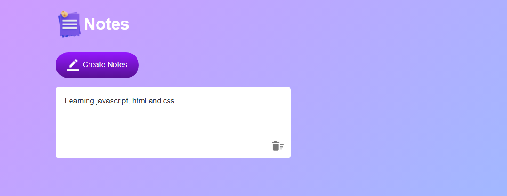

# 📝 Notes App

A simple and responsive Notes App built with **HTML**, **CSS**, and **JavaScript**. This app allows users to create, edit, and delete notes directly in the browser — with all changes automatically saved using `localStorage`.

## 🚀 Features

- ✅ Create unlimited editable notes
- ✅ Delete notes with a single click
- ✅ Changes are automatically saved to `localStorage`
- ✅ Notes persist even after refreshing or closing the browser
- ✅ Clean and minimal UI with responsive design

## 💻 Technologies Used

- HTML5
- CSS3
- JavaScript 
- `localStorage` API

## 📸 Screenshots



## 🛠️ How It Works

1. Click the **"Create Note"** button to add a new editable note.
2. Start typing — your notes are automatically saved.
3. Click the 🗑️ delete icon to remove a note.
4. Your notes are stored in your browser’s `localStorage`.

## 📂 Project Structure
```
notes-app/
│
├── index.html # Main HTML file
├── style.css # App styling
├── script.js # JavaScript logic
├── images/
│ └── delete.png # Delete icon used in each note
│ └── Capture.PNG 
```

## 📦 Setup Instructions

1. Clone this repository:
   ```bash
   git clone https://github.com/your-username/notes-app.git
   ```
2. Open index.html in your browser to run the app.

## 🔒 Storage Info
All notes are stored locally in your browser via localStorage. No data is sent to any server.
## 🙌 Credits
Developed by Ellias Sithole
